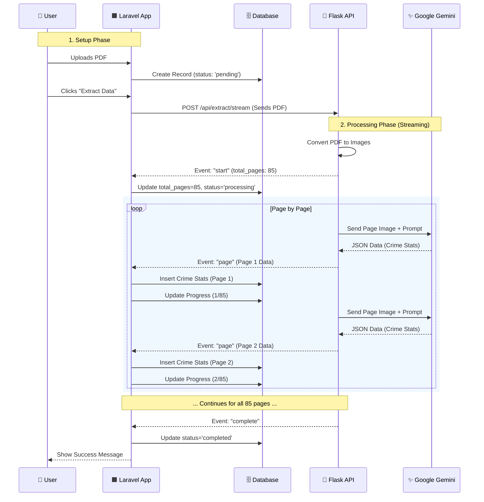

# System Workflow Diagram

This document visualizes how the Laravel Application communicates with the Python Flask API to extract data from PDFs.

## 🌊 High-Level Data Flow

```mermaid
graph TD
    User[👤 User] -->|1. Uploads PDF| Laravel[Laravel App]
    Laravel -->|2. Stores PDF| Storage[📂 File Storage]
    User -->|3. Clicks 'Extract'| Laravel
    
    subgraph "Extraction Process"
        Laravel -->|4. Streams PDF| Flask[🐍 Flask API]
        Flask -->|5. Converts to Images| Images[🖼️ Images]
        Images -->|6. Sends Images| Gemini[✨ Google Gemini AI]
        Gemini -->|7. Returns Structured Data| Flask
        Flask -->|8. Streams JSON (Page-by-Page)| Laravel
    end
    
    subgraph "Real-Time Saving"
        Laravel -->|9. Saves Stats| DB[(🗄️ MySQL Database)]
        Laravel -->|10. Updates Progress| DB
    end
    
    DB -.->|11. Show Progress| User
```

---

## ⏱️ Detailed Sequence (Streaming)

This shows exactly what happens over time when processing a large (e.g., 85-page) PDF.



## 🏗️ Architecture Components

| Component | Responsibility |
|-----------|----------------|
| **Laravel App** | Master controller. Manages users, database, and initiates extraction. |
| **Flask API** | "The Worker". specialized microservice that handles PDF processing and AI communication. |
| **Google Gemini** | "The Brain". Reads the PDF images and understands the structure of crime tables. |
| **Streaming Link** | A specialized connection that stays open, allowing data to flow like water instead of waiting for the whole bucket. |

## 🚀 Why This Design?

1.  **No Timeouts**: Standard web requests time out after 60 seconds. This streaming connection can stay open for minutes (needed for 85 pages).
2.  **Instant Feedback**: You don't stare at a loading screen for 5 minutes. You see "Processing page 1... 2... 3..." immediately.
3.  **Data Safety**: If the server crashes at page 50, you still have the first 49 pages safely saved in your database.
